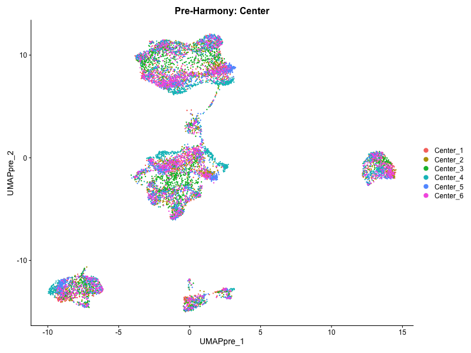
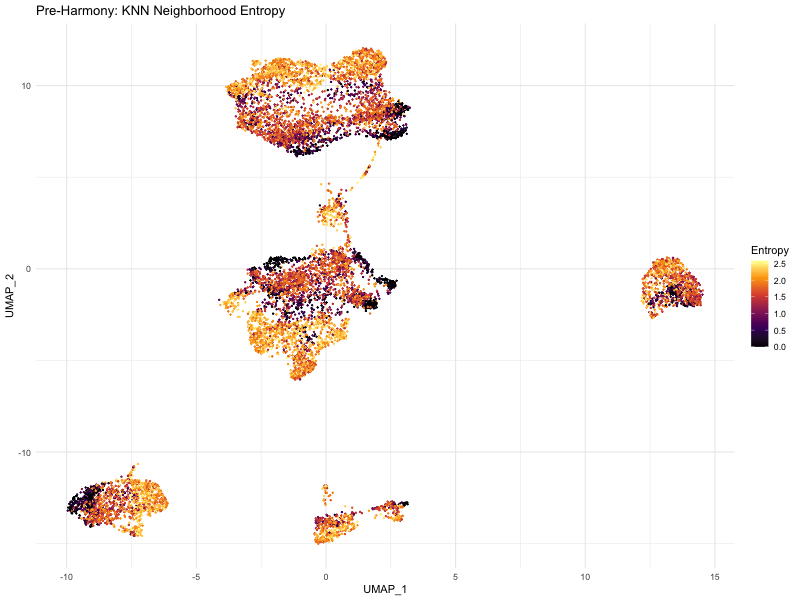
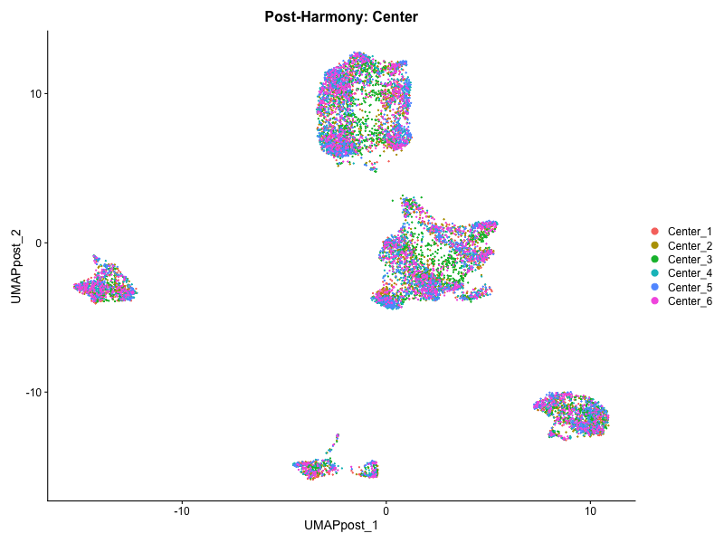
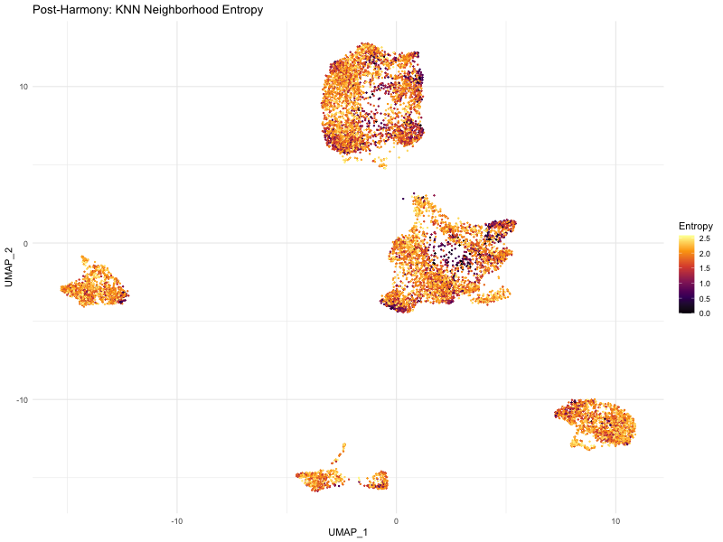
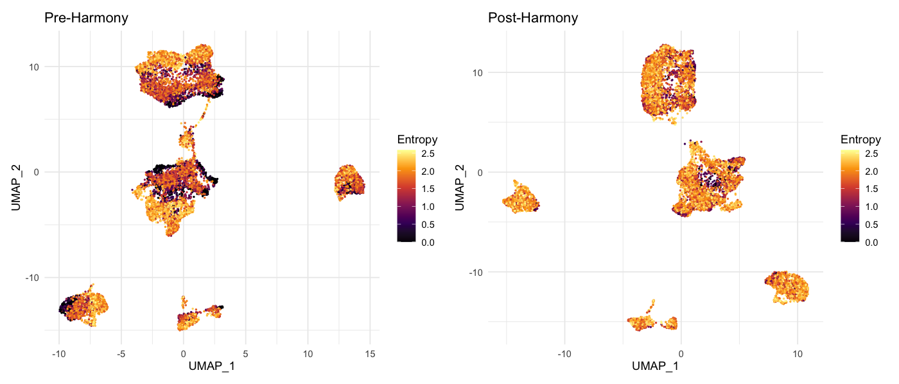
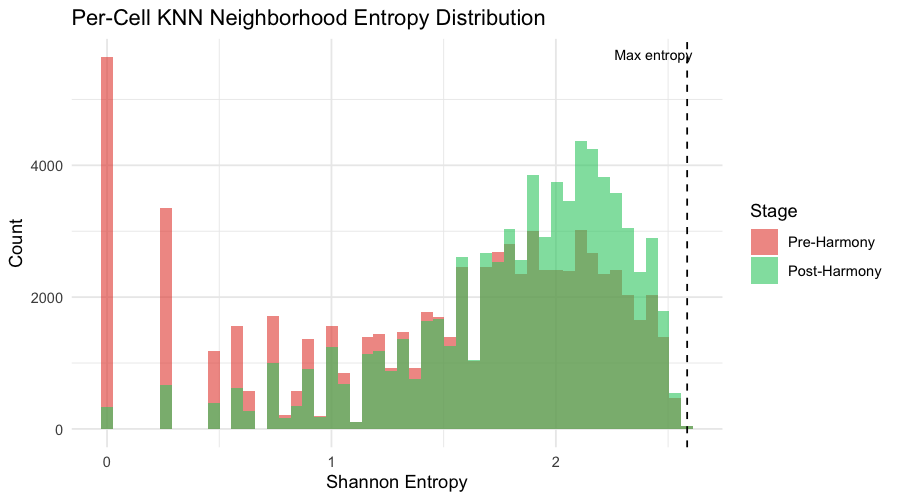
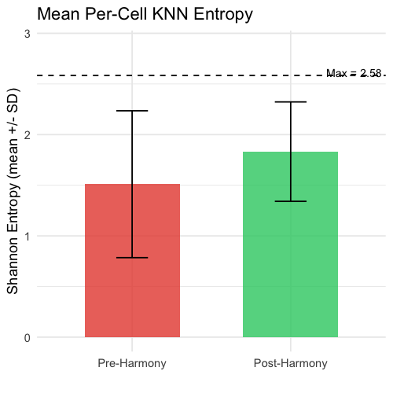
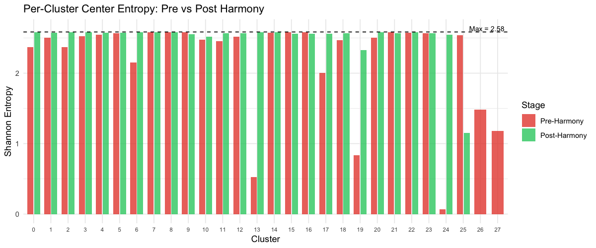
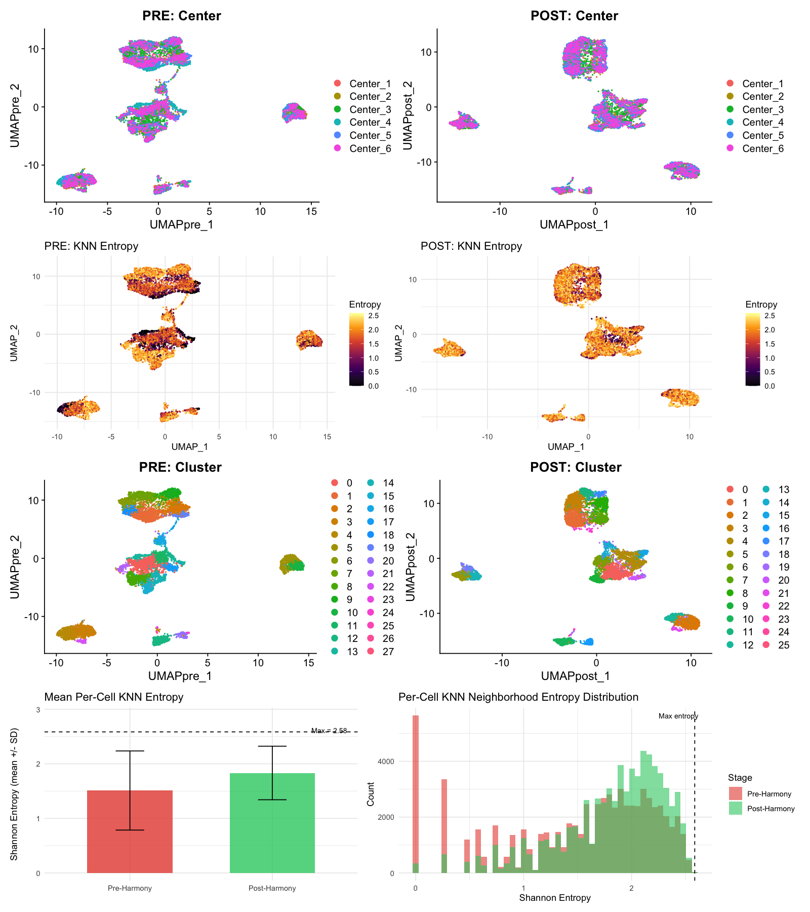

```{r setup, include=FALSE}
knitr::opts_chunk$set(echo = FALSE, warning = FALSE, message = FALSE, fig.width = 10, fig.height = 7)
```

# Introduction

Mass cytometry (CyTOF) enables high-dimensional single-cell protein measurement, but multi-center studies introduce technical batch effects that can confound biological signal. This report investigates whether batch effects can be detected and corrected in CyTOF data using tools from the single-cell RNA-seq ecosystem -- specifically, **Seurat** for data management and visualization, and **Harmony** for batch correction.

## Dataset

The data comes from a multi-center CyTOF study with:

- **6 centers**, each contributing 6 samples (3 conditions x 2 replicates)
- **36 total FCS files**, subsampled to 2,000 cells each (72,000 cells total)
- **19 surface (type) markers**: CD27, CD3, CD123, CD33, CD14, CD61, CD19, CD4, CD8A, CD16, CD235, CD20, CD66, CD45, CD11C, CD45RA, CD38, HLADR, CD56

Data was asinh-transformed with a cofactor of 5 (standard for CyTOF) and loaded directly into Seurat without normalization, scaling, or PCA -- appropriate for the low-dimensional CyTOF marker space.

## Batch Effect Quantification Approach

We use **KNN neighborhood entropy** as the primary metric for batch mixing. For each cell, we examine its k-nearest neighbors (computed by Seurat's `FindNeighbors`), tally the center labels in that neighborhood, and compute Shannon entropy. With 6 centers, the maximum entropy is `r round(log2(6), 2)` bits (perfectly mixed neighborhoods). Low entropy indicates batch-dominated neighborhoods. This gives us:

1. A **per-cell score** that can be plotted on the UMAP
2. A **distribution** that can be compared as histograms
3. A **summary statistic** (mean +/- SD) for direct comparison

Additionally, we compute **per-cluster entropy** from the cluster-by-center contingency table to identify specific clusters that are batch-dominated.

# Batch Effect Detection (Pre-Harmony)

## UMAP Colored by Center

```{r pre-center, fig.width=10, fig.height=6}

```

The pre-Harmony UMAP shows clear segregation by center. Several regions of the UMAP are dominated by individual centers, particularly Center 4.

## UMAP Colored by KNN Neighborhood Entropy

```{r pre-entropy, fig.width=10, fig.height=6}

```

The entropy map makes the batch effect immediately visible. Dark regions (low entropy) correspond to neighborhoods where cells are surrounded primarily by cells from the same center. Bright regions (high entropy) indicate well-mixed neighborhoods. Large swaths of the UMAP are dark, confirming substantial batch effects.

**Pre-Harmony per-cell KNN entropy: mean = 1.51, SD = 0.73 (max possible = 2.58)**

# Harmony Batch Correction

Harmony was applied to the 19-dimensional marker space, correcting for center identity. Harmony converged in 3 iterations. After correction, the KNN graph, clustering, and UMAP were all re-computed on the Harmony-corrected embeddings.

# Post-Harmony Results

## UMAP Colored by Center

```{r post-center, fig.width=10, fig.height=6}

```

After Harmony, centers are much better mixed across the UMAP. The Center 4-specific regions have been integrated.

## UMAP Colored by KNN Neighborhood Entropy

```{r post-entropy, fig.width=10, fig.height=6}

```

The post-Harmony entropy map is dramatically brighter. Most cells now have high-entropy neighborhoods, indicating good mixing.

**Post-Harmony per-cell KNN entropy: mean = 1.83, SD = 0.49 (max possible = 2.58)**

# Direct Comparisons

## KNN Entropy UMAP: Side by Side

```{r entropy-comparison, fig.width=12, fig.height=5}

```

## KNN Entropy Distribution

```{r entropy-hist, fig.width=10, fig.height=5}

```

The histogram clearly shows the shift: pre-Harmony (red) has a broad distribution extending to very low entropies, while post-Harmony (green) is concentrated at higher entropies. The dashed line marks the theoretical maximum for perfect mixing.

## Mean KNN Entropy (Bar Plot)

```{r entropy-bar, fig.width=5, fig.height=5}

```

| Metric | Pre-Harmony | Post-Harmony |
|--------|-------------|--------------|
| Mean per-cell KNN entropy | 1.51 | 1.83 |
| SD | 0.73 | 0.49 |
| % of max entropy | 58.4% | 70.9% |

## Per-Cluster Center Entropy

```{r cluster-entropy, fig.width=12, fig.height=5}

```

Pre-Harmony, several clusters had very low center entropy (clusters 13, 19, 24 were almost entirely from a single center). Post-Harmony, nearly all clusters are near the maximum entropy, indicating good mixing within each cluster.

| Metric | Pre-Harmony | Post-Harmony |
|--------|-------------|--------------|
| Mean cluster entropy | 2.19 | 2.51 |
| Clusters with entropy < 1.5 | 4 | 1 |

## Full Comparison Panel

```{r full-comparison, fig.width=14, fig.height=14}

```

# Discussion

## Can we detect batch effects in CyTOF data within Seurat?

**Yes.** The KNN neighborhood entropy approach provides a clear, quantitative, and spatially-resolved view of batch effects. By leveraging Seurat's `FindNeighbors` graph and computing Shannon entropy per cell, we can:

- Visualize exactly where batch effects are concentrated on the UMAP
- Summarize the overall mixing quality as a single number
- Compare distributions before and after correction

This is more informative than simple visual inspection of color-coded UMAPs, as it converts a subjective assessment into a quantitative metric.

## Did Harmony correct the batch effects?

**Partially.** Harmony improved batch mixing, but the correction was incomplete:

1. **Per-cell KNN entropy** increased from 1.51 to 1.83 (58.4% to 70.9% of theoretical max), with the standard deviation narrowing from 0.73 to 0.49
2. **Per-cluster entropy** increased from 2.19 to 2.51 (out of max 2.58), eliminating the most severely batch-dominated clusters
3. **Visual assessment** shows noticeably improved mixing on the UMAP and entropy maps

The improvement is real but modest. A mean entropy of 1.83 out of 2.58 means the average cell's neighborhood is still not well-mixed. Whether this level of correction is sufficient depends on the downstream application.

## Caveats and open questions

1. **Biological signal preservation was not assessed.** This is the most important limitation. The dataset contains 3 conditions (A, B, P) nested within the 6 centers. Harmony was told to correct for center, but we did not verify whether condition-level biological differences survived the correction. In a production analysis, this would need to be checked before proceeding.

2. **Not perfect mixing**: The post-Harmony mean entropy (1.83) is still well below the theoretical maximum (2.58). Some residual separation may reflect genuine biological differences between centers (different patient populations, sample handling). Complete mixing may not be the goal -- we want to remove technical variation while preserving biology -- but we did not disentangle the two here.

3. **UMAP and entropy were computed on different cell sets**: UMAP was computed on a 10,000-cell subset, while the entropy metrics were computed on all 72,000 cells using the full KNN graph. The UMAP visualizations and the entropy summary statistics do not correspond to the same cells.

4. **Seurat adaptation required**: CyTOF analysis in Seurat requires bypassing the standard scRNA-seq pipeline (no normalization, no PCA) and treating the marker space directly as the embedding. This works, but it is not the intended use case for either Seurat or Harmony. Harmony can also be run directly on a matrix via `HarmonyMatrix()`, which would avoid the Seurat workarounds entirely.

# Conclusion

Batch effects in multi-center CyTOF data can be detected using KNN neighborhood entropy and partially corrected using Harmony, all within the Seurat ecosystem. The KNN entropy approach provides clear, quantitative evidence of batch effects. Harmony reduced batch-dominated neighborhoods and improved cross-center mixing, though the correction was incomplete and biological signal preservation was not verified. A production workflow would need to address both of these gaps -- and would likely benefit from using `HarmonyMatrix()` directly rather than routing through Seurat's scRNA-seq-oriented pipeline.

```{r session}
sessionInfo()
```
